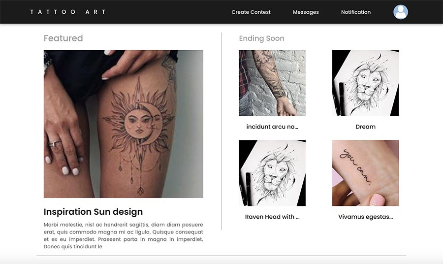
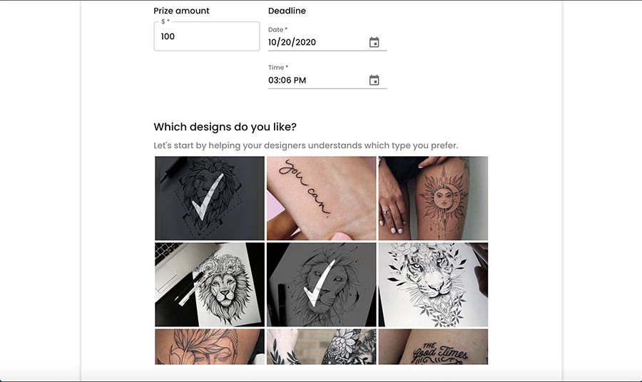
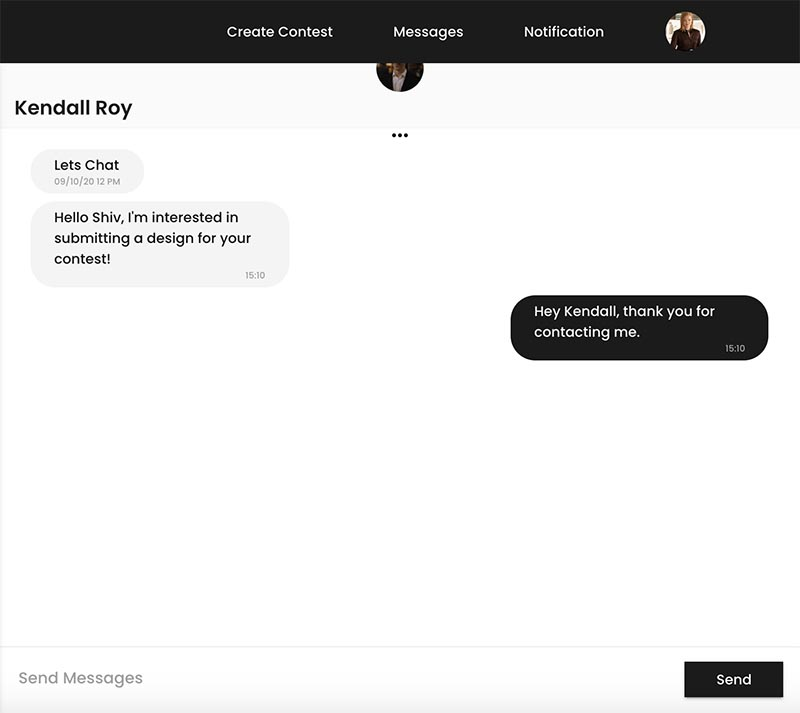
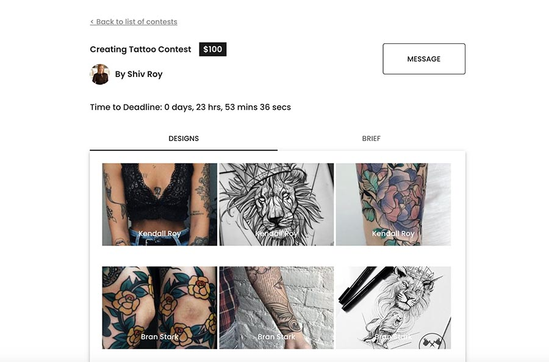

## Tattoo-Art

Tattoo Art is a web app that brings together tattoo artists and tattoo seekers in a Airbnb like marketplace. Tattoo seekers can post design contest with a prize and tattoo artists can submit their custom designs to compete for a reward.

## Contributors

[Bonnie Li](https://github.com/bonnieli), [Rhut Virani](https://github.com/Rhut-virani), [Leonard Shen](https://github.com/UVStudio)

## Gallery

## TechStack:

- React.js/Material UI
- Express/Node.js
- MongoDB
- AWS S3
- Socket.io
- Stripe Connect
- JWT
- Bcrypt

## Features

- Users can sign-up, login to our platform.
- A user can be both contest creator and tattoo artist.
- A user planning on creating a contest must submit their credit card information to Stripe through our app.
- A user planning on competing on contests must submit their banking information to Stripe.
- Users can communicate with one another through instant chat messaging.
- Users can create timed contests, and users and submit their designs.
- Once a contest reaches the deadline, the contest creator can pick a winner. The winning prize will be sent to the winner's bank account via Stripe Connect.

## Installations

1. cd to the client directory (front-end)
2. Install dependencies via `npm install`
3. start the app via `npm start`
4. Head to http://localhost:3000 on the browser
5. cd to the server directory (back-end)
6. Install dependencies via `npm install`
7. run server via `npm run dev`
8. server will run on http://localhost:3001
9. Add API Key Dependencies to the project **instructions pending**

